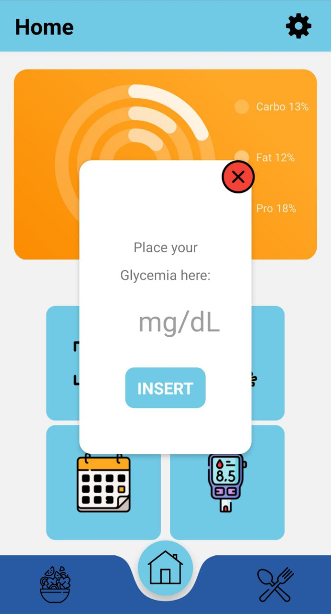
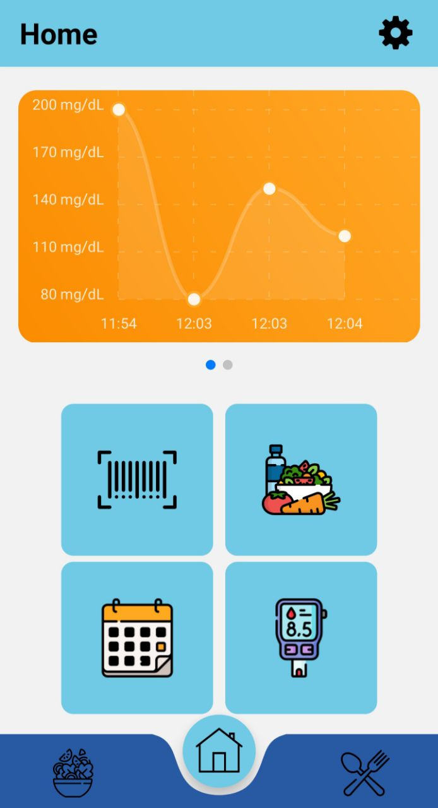
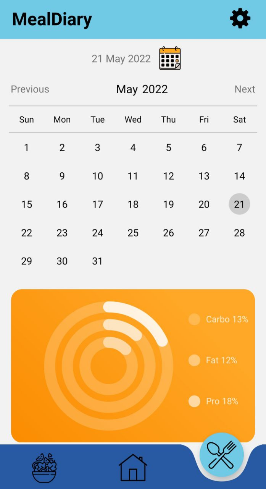
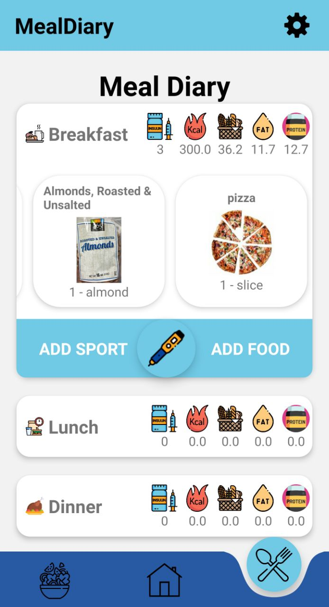
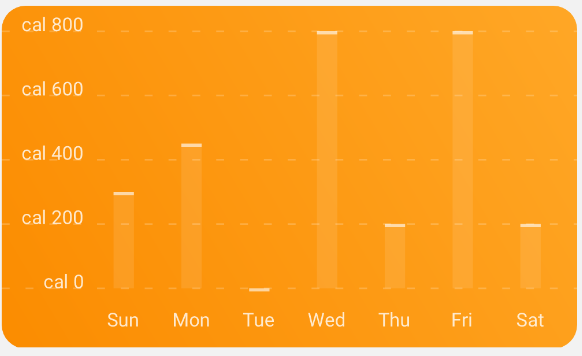
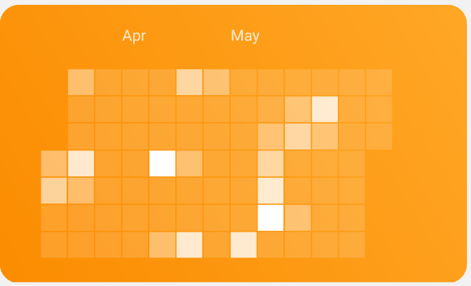
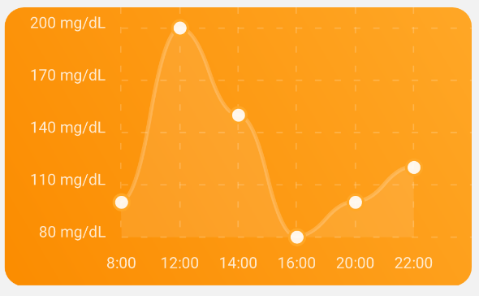
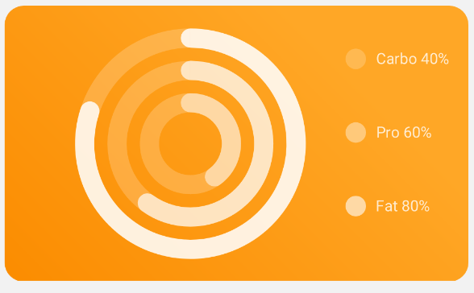

# Insulink
An App to help diabetic people!

> :warning: **WARNING: This app is for accademic purpose only**, always contact a doctor since our calculation could be inprecise)
## Features:
1. Keep track of blood sugar level (With diary chart)
2. Keep track of meals in times.
3. Keep track of sport activity.
4. Allow user to approximatly compute how much insuline unit to assume after a meal.
5. Bar Code scanner (Support only US foods)

## App Screens:

## Charts availables on Home Page:

## Documentation
You can find our documentation both in [summarized slides](documentation/Presentation%20Slides%20.pdf) or in a more [tecnical report](documentation/documentation.pdf).
### HOW TO RUN 

> :warning: **SECTION TODO, WORK IN PROGRESS**

Emulators commands:

npx react-native start
npx react-native run-android
npx react-native run-android --device "SM-G960F - 10"
cd ios && pod install
npx react-native run-ios --device "Marco’s iPad"

Build commands:
cd android && ./gradlew assembleRelease     
SLIDE:
https://docs.google.com/presentation/d/1b-Rr0jK8Sc6tSviaiHIciBBTXETeNHYzBfHymhFxCGc/edit#slide=id.g85d32b42a5_0_559
    //LINK TO TEST UPC 
    //https://docs.google.com/document/d/1hZ69q8BhEgEVHbFzQnPlGNPjyJycKWBDhY1jsT13np8/mobilebasic
